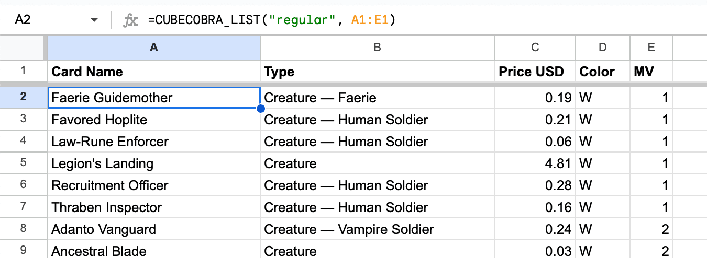

# Cube Cobra for Google Sheets

Fetch Cube lists from [Cube Cobra](http://cubecobra.com) within Google Sheets.

## Installation

To install, copy and paste the
[script](https://raw.githubusercontent.com/ahmattox/cube-cobra-google-sheets/main/cube-cobra-google-sheets.js)
to a sheet, or
[copy this example Sheet](https://docs.google.com/spreadsheets/d/1PzuM-HXyQchaK6Lt8AKfYQIHmoEJ_xBg66hQXQLC3D0/edit?usp=sharing).

To add the script, in a Sheet go to "Extensions" > "Apps Scripts". Copy and
paste the contents of
[cube-cobra-google-sheets.js](https://raw.githubusercontent.com/ahmattox/cube-cobra-google-sheets/main/cube-cobra-google-sheets.js)
into the text field and save.

## Usage

The script adds two functions to fetch a Cube's list of cards and metadata about
the Cube.



```
=CUBECOBRA_LIST(url, fields)
```

Pass in the URL or ID of a Cube and the columns you want to fetch. Cards will
fill in across rows starting with the row with the formula, and columns with the
specified attributes.

The fields are case insensitive and can be space or underscore separated. Some
aliases are handled, e.g. `Name`, `Card`, `card_name`, or `cmc`, `mv`, or
`Mana Value`. See [card-attributes.txt](card-attributes.txt) for a list of
attributes.

Fields can be specified with a row or column of the sheet, or passed directly to
the formula:

```
=CUBECOBRA_LIST("regular", { "name", "cmc" } )
```

### List Order

Cards are sorted in a 'normal' Magic way by color, type, and then mana value.
You can use sheet formulas on the fetched values or edit the script directly to
change the sort.

### Up-to-date Lists

The Cube is fetched dynamically so if you make changes to the list on CC those
changes will automatically appear when you open a sheet referencing it. If you
want to keep a specific list that wont change (or will load quicker), copy and
paste the resulting cells.

### Cube Metadata

Cube metadata works the same way for attributes about the cube.

```
=CUBECOBRA_METADATA("regular", { "name", "cardCount", "imageName" })
```

## Notes

This repository is not affiliated with or endorsed by
[Cube Cobra](https://cubecobra.com). Find more tools for Magic, and especially
Cube, on [Lucky Paper](https://luckypaper.co). Inspiration thanks to
[Scryfall's sheet integration](https://github.com/scryfall/google-sheets).

Questions, issues, or want to expand this repo? Find me on
[Twitter](https://twitter.com/ahmattox) or
[Discord](https://discordapp.com/users/226747568866983938).
